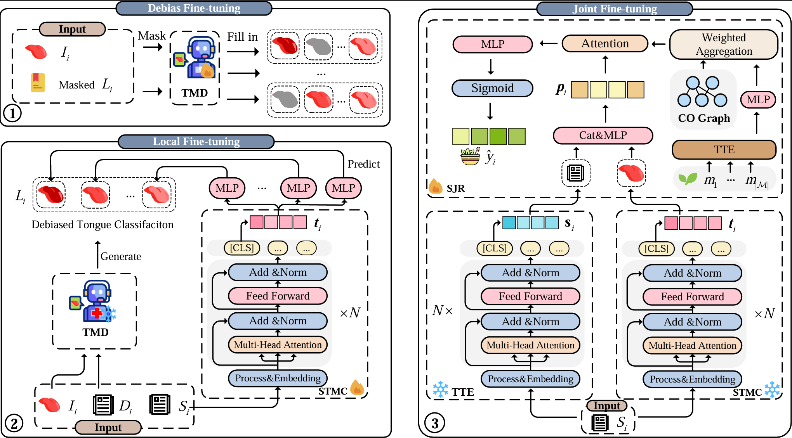
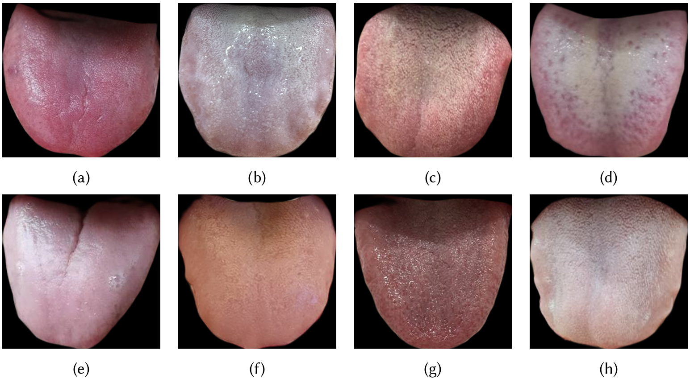
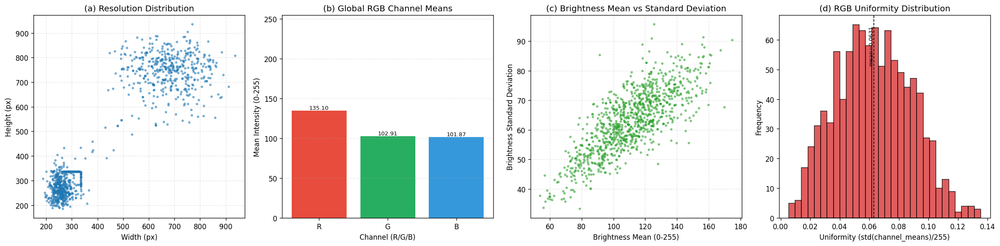
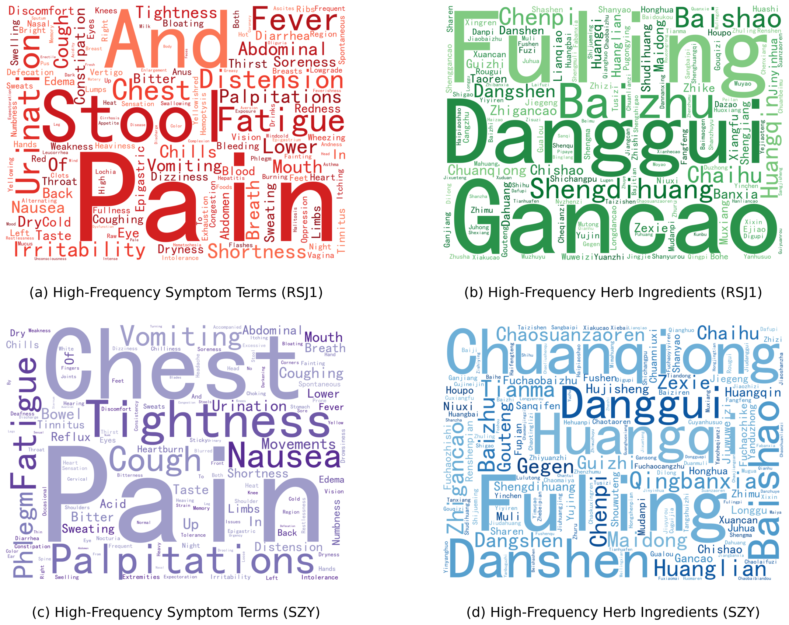
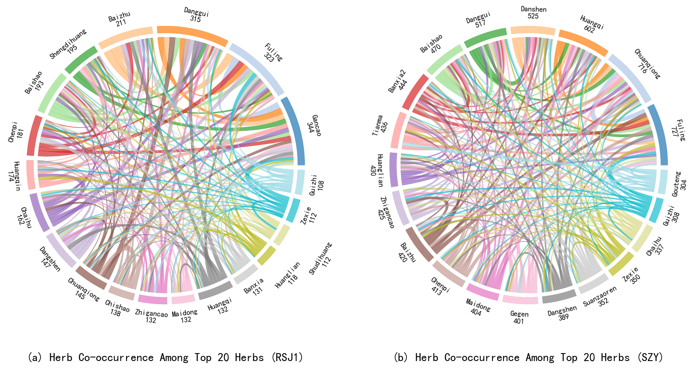
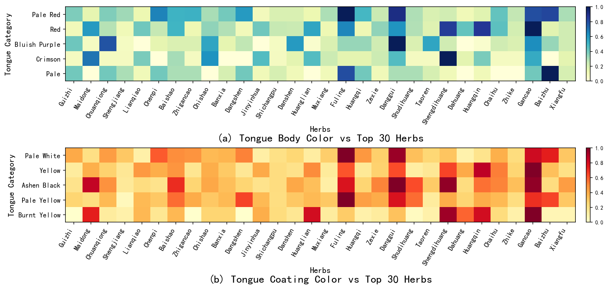
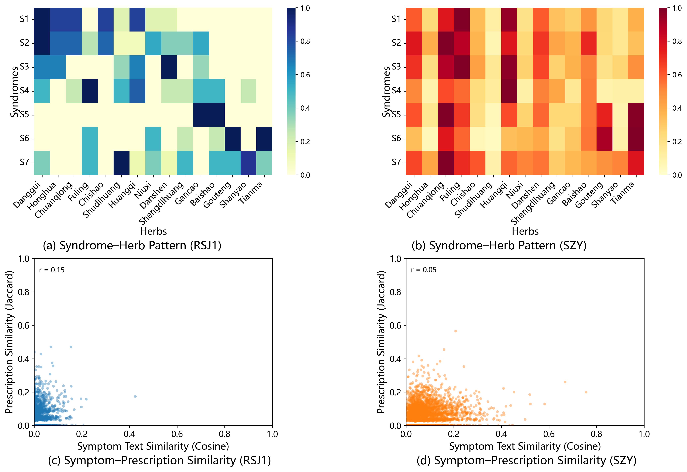

# SemTon

Semantics-driven Traditional Chinese Medicine Prescription Recommendation with Tongue Manifestation Completion

## Environment

```
python==3.9.18
torch==2.1.1
tqdm==4.66.1
scikit-learn==1.3.2
```

You can build the conda environment for our experiment using the following command:

```
conda env create -f environment.yml
```

## Datasets

We have disclosed the details of the dataset along with examples, and conducted detailed analyses in the paper.

Here, we extracted 50 complete samples   in each of RSJ1 and SZY for reference. Please go to the `data` folder to view them.

The full datasets will be made publicly avail able once the manuscript is accepted.

- `data/`

  - **RSJ1.json**

  - **SZY.json**

  - **images.zip**: Images corresponding to RSJ1 dataset.

| **Items**                           | **RSJ1**        | **SZY**      |
| ----------------------------------- | --------------- | ------------ |
| **# of patients / # of herbs**      | 1,000 / 1,048   | 1,500 / 369  |
| **avg. / max # of herbs**           | 11.23 / 26      | 15.11 / 39   |
| **avg. / max # of symptom text**    | 122.91 / 393    | 136.42 / 388 |
| **avg. / max # of tongue text**     | 6.35 / 20       | -            |
| **avg. size of image width/height** | 267.15 / 277.39 | -            |

### Image Exaxmple


### Image quality and color consistency analysis across the RSJ1 dataset


### High-frequency symptom terms and herb ingredients in two TCM datasets


### A co-occurrence analysis of two datasets using chord diagrams


### Comparative analyses of herb preference for tongue body color and tongue coating color in two datasets


### Integrated comparison analyses of syndrome-herb patterns and symptom-prescription similarities across two datasets


## Run the SemTon

You can train and test the model using the following command:

```python
cd src
# Stage 1 for debais if you need, please download Qwen2.5-VL weights at https://github.com/QwenLM/Qwen2-VL
python debias_fine-tuning.py
python list_chat.py
# Stage 2 for tongue completion
python local_fine-tuning.py
# Stage 3 for TCMPR
python joint_fine-tuning.py
```

We provide the weights of the fine-tuned TMD module as well as the STMC module, please download at: https://pan.quark.cn/s/fad8b87e0c5d   key：EbLW

## Acknowledgement

None
